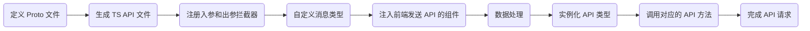

# thgamejam-proto

# Proto 文件生成 TS API 文件流程

## 概述
该流程描述了如何通过 Proto 文件生成 TypeScript（TS） API 文件，并使用拦截器和自定义消息类型实现类似 RPC 的 API 请求。同时，将生成的 API 文件注入到前端发送 API 请求的组件中（例如 Axios），通过实例化 API 类型调用对应的 API 方法。

## 流程图



# Proto 文件生成 Python API 文件流程

## 概述
该流程描述了如何通过 Proto 文件生成 Python API 文件，并使用拦截器和自定义消息类型实现类似 RPC 的 API 请求。同时，将生成的 API 文件注入到后端注册 API 的组件中（例如 FastAPI），通过实例化 API 类型调用对应的 API 方法。

## 流程图

```mermaid
graph LR

A(定义 Proto 文件) --> B(生成 Python API 文件)
B --> C(注册入参和出参拦截器)
C --> D(自定义消息类型)
D --> E(注入后端注册 API 的组件)
E --> F(数据处理)
F --> G(实例化 API 类型)
G --> H(调用对应的 API 方法)
H --> I(完成 API 请求)