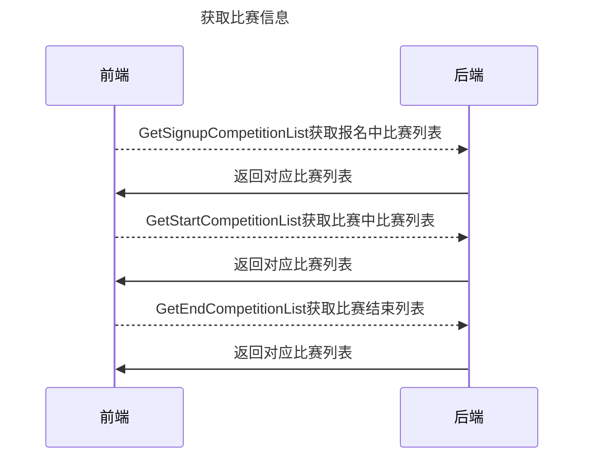
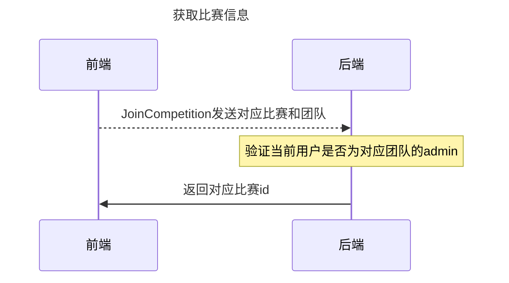
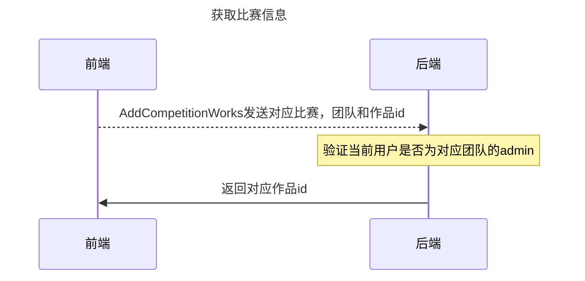

## 主界面获取比赛信息

```mermaid
sequenceDiagram
    title: 获取比赛信息
    participant 前端
    participant 后端
    前端-->>后端: GetSignupCompetitionList获取报名中比赛列表
    后端->> 前端: 返回对应比赛列表
    前端-->>后端: GetStartCompetitionList获取比赛中比赛列表
    后端->> 前端: 返回对应比赛列表
    前端-->>后端: GetEndCompetitionList获取比赛结束列表
    后端->> 前端: 返回对应比赛列表
```

## 参加比赛

```mermaid
sequenceDiagram
    title: 获取比赛信息
    participant 前端
    participant 后端
    前端-->>后端: JoinCompetition发送对应比赛和团队
    note over 后端: 验证当前用户是否为对应团队的admin
    后端->> 前端: 返回对应比赛id
```

## 提交作品

```mermaid
sequenceDiagram
    title: 获取比赛信息
    participant 前端
    participant 后端
    前端-->>后端: AddCompetitionWorks发送对应比赛，团队和作品id
    note over 后端: 验证当前用户是否为对应团队的admin
    后端->> 前端: 返回对应作品id
```
