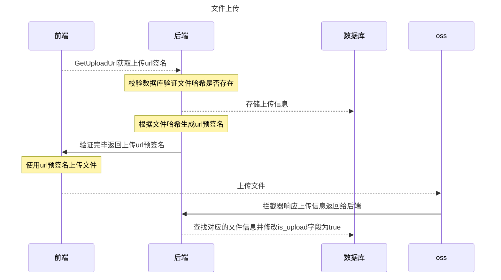
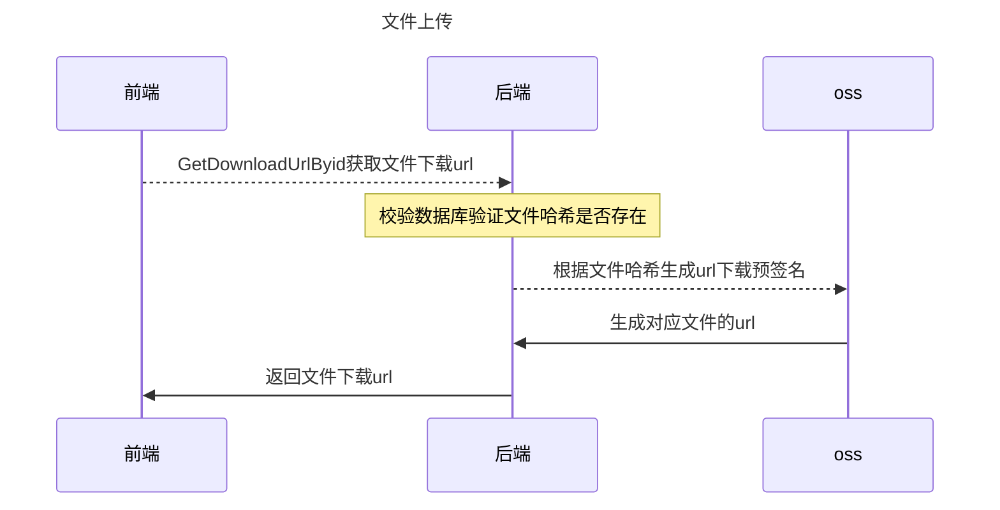

## 文件上传流程

```mermaid
sequenceDiagram
    title: 文件上传
    participant 前端
    participant 后端
    participant 数据库
    participant oss
    前端-->>后端: GetUploadUrl获取上传url签名
    note over 后端: 校验数据库验证文件哈希是否存在
    后端-->>数据库: 存储上传信息
    note over 后端: 根据文件哈希生成url预签名
    后端->> 前端: 验证完毕返回上传url预签名
    
    note over 前端: 使用url预签名上传文件
    前端-->>oss: 上传文件
    oss->> 后端: 拦截器响应上传信息返回给后端
    后端-->> 数据库: 查找对应的文件信息并修改is_upload字段为true
```

## 文件下载url流程

```mermaid
sequenceDiagram
    title: 文件上传
    participant 前端
    participant 后端
    participant oss
    前端-->>后端: GetDownloadUrlByid获取文件下载url
    note over 后端: 校验数据库验证文件哈希是否存在
    后端-->> oss: 根据文件哈希生成url下载预签名
    oss->> 后端: 生成对应文件的url
    后端->> 前端: 返回文件下载url
```