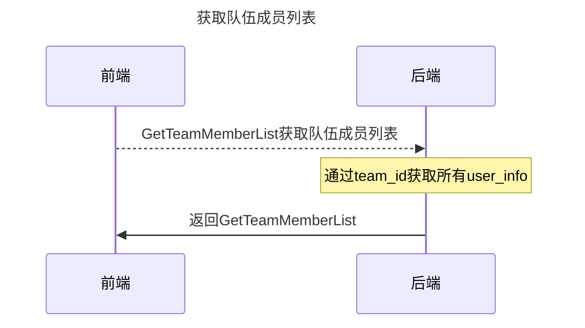
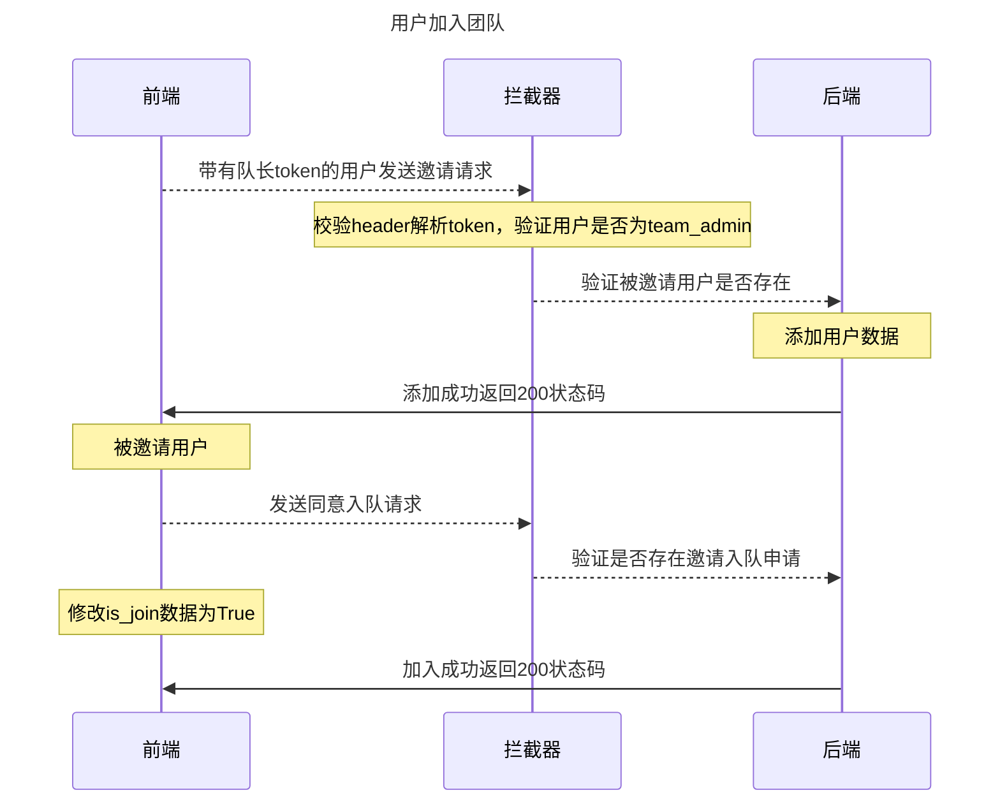

## 获取队伍成员列表API

```mermaid
sequenceDiagram
    title: 获取队伍成员列表
    participant 前端
    participant 后端
    前端-->>后端: GetTeamMemberList获取队伍成员列表
    note over 后端: 通过team_id获取所有user_info
    后端->> 前端: 返回GetTeamMemberList
```

## 用户加入团队时序图

```mermaid
sequenceDiagram
    title: 用户加入团队
    participant 前端
    participant 拦截器
    participant 后端
    前端-->>拦截器: 带有队长token的用户发送邀请请求
    note over 拦截器: 校验header解析token，验证用户是否为team_admin
    拦截器-->>后端: 验证被邀请用户是否存在
    note over 后端: 添加用户数据
    后端->> 前端: 添加成功返回200状态码
    note over 前端: 被邀请用户
    前端-->> 拦截器: 发送同意入队请求
    拦截器-->>后端: 验证是否存在邀请入队申请
    note over 前端: 修改is_join数据为True
    后端->>前端: 加入成功返回200状态码
```
