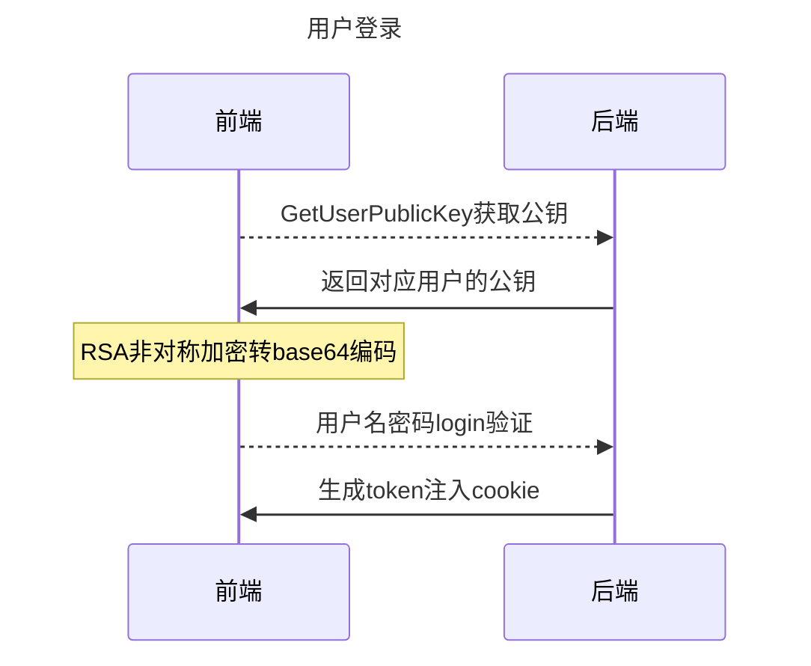
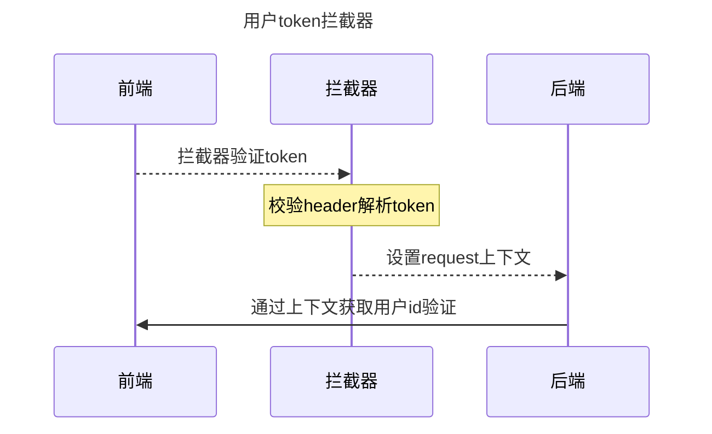

## 用户登录API

```mermaid
sequenceDiagram
    title: 用户登录
    participant 前端
    participant 后端
    前端-->>后端: GetUserPublicKey获取公钥
    后端->> 前端: 返回对应用户的公钥
    note over 前端: RSA非对称加密转base64编码
    前端-->>后端: 用户名密码login验证
    后端->> 前端: 生成token注入cookie
```

## 用户token拦截器API

```mermaid
sequenceDiagram
    title: 用户token拦截器
    participant 前端
    participant 拦截器
    participant 后端
    前端-->>拦截器: 拦截器验证token
    note over 拦截器: 校验header解析token
    拦截器-->>后端: 设置request上下文
    后端->> 前端: 通过上下文获取用户id验证
```
