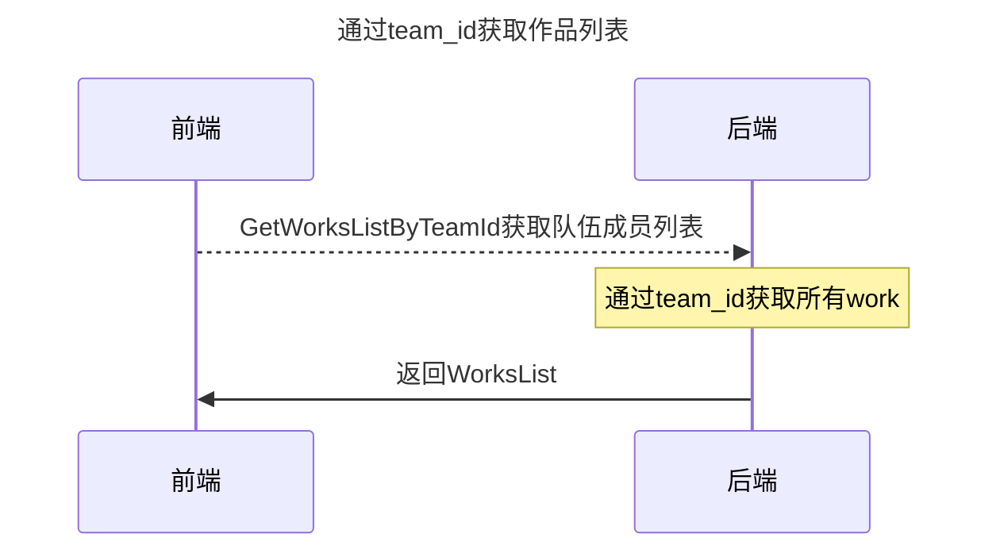
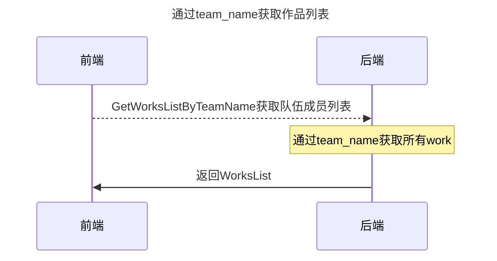
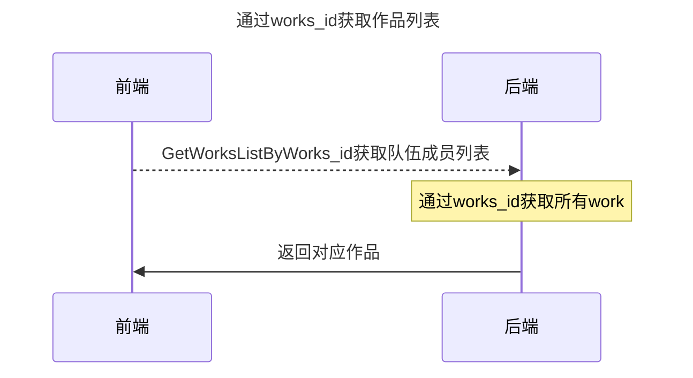
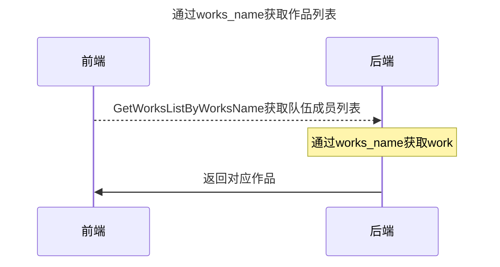
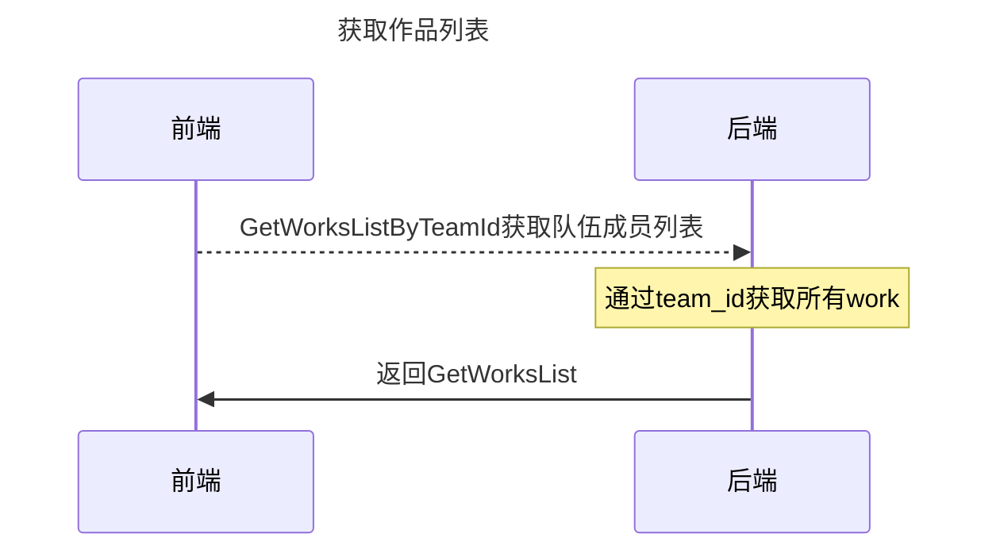
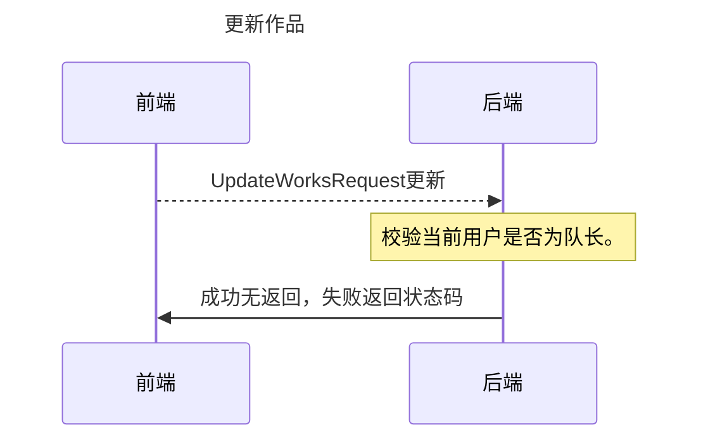
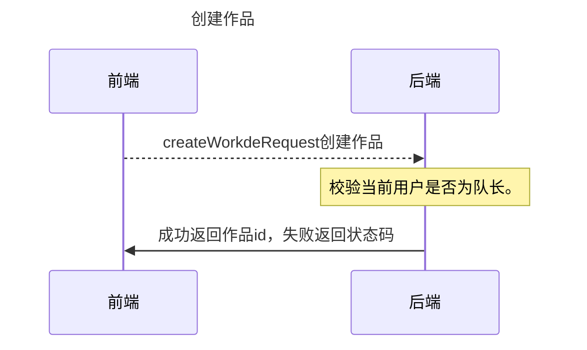

## 通过team_id获取作品列表

```mermaid
   sequenceDiagram
    title: 通过team_id获取作品列表
    participant 前端
    participant 后端
    前端-->>后端: GetWorksListByTeamId获取队伍成员列表
    note over 后端: 通过team_id获取所有work
    后端->> 前端: 返回WorksList
```

## 通过team_name获取作品列表

```mermaid
   sequenceDiagram
    title: 通过team_name获取作品列表
    participant 前端
    participant 后端
    前端-->>后端: GetWorksListByTeamName获取队伍成员列表
    note over 后端: 通过team_name获取所有work
    后端->> 前端: 返回WorksList
```

## 通过works_id获取作品

```mermaid
   sequenceDiagram
    title: 通过works_id获取作品列表
    participant 前端
    participant 后端
    前端-->>后端: GetWorksListByWorks_id获取队伍成员列表
    note over 后端: 通过works_id获取所有work
    后端->> 前端: 返回对应作品
```

## 通过works_name获取作品列表

```mermaid
   sequenceDiagram
    title: 通过works_name获取作品列表
    participant 前端
    participant 后端
    前端-->>后端: GetWorksListByWorksName获取队伍成员列表
    note over 后端: 通过works_name获取work
    后端->> 前端: 返回对应作品
```

## 通过team_id获取作品列表

```mermaid
   sequenceDiagram
    title: 获取作品列表
    participant 前端
    participant 后端
    前端-->>后端: GetWorksListByTeamId获取队伍成员列表
    note over 后端: 通过team_id获取所有work
    后端->> 前端: 返回GetWorksList
```

## 删除作品

```mermaid
   sequenceDiagram
    title: 删除作品
    participant 前端
    participant 后端
    前端-->>后端: DeleteWorksByIdRequest删除作品
    note over 后端: 校验当前用户是否为队长。
    后端->> 前端: 成功无返回，失败返回状态码
```

## 更新作品

```mermaid
   sequenceDiagram
    title: 更新作品
    participant 前端
    participant 后端
    前端-->>后端: UpdateWorksRequest更新
    note over 后端: 校验当前用户是否为队长。
后端->> 前端: 成功无返回，失败返回状态码
  
```

## 创建作品

```mermaid
   sequenceDiagram
    title: 创建作品
    participant 前端
    participant 后端
    前端-->>后端: createWorkdeRequest创建作品
    note over 后端: 校验当前用户是否为队长。
    后端->> 前端: 成功返回作品id，失败返回状态码
```
