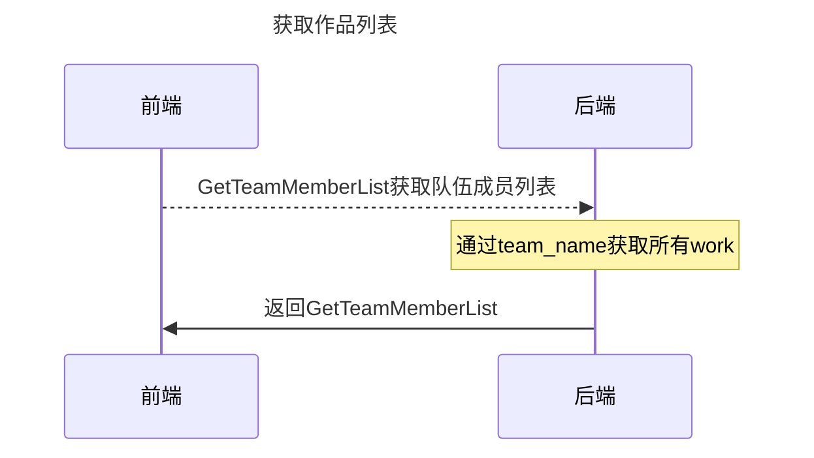

## 获取作品列表

```mermaid
   sequenceDiagram
    title: 获取作品列表
    participant 前端
    participant 后端
    前端-->>后端: GetTeamMemberList获取队伍成员列表
    note over 后端: 通过team_name获取所有work
    后端->> 前端: 返回GetTeamMemberList
```

